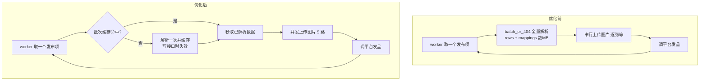

## 产品概述

批量发布中台在 300~800 商品规模下性能不足，需在不损失现有功能的前提下优化「类目/属性匹配 → 保存切换 → 后台发布」全链路速度。

## 核心需求

- **规模**：单批 300~800 商品（当前 9 个已明显卡顿）
- **需优化的三个环节**（用户勾选）：

1. 点「立即匹配」后等类目 + 属性加载（匹配阶段慢）
2. 点「保存自动映射并继续」「创建任务」切换时卡顿（保存/加载慢）
3. 发布任务后台执行进度条走得慢（worker 发布慢）

- **已确认取舍**：
- 属性候选值（如「材质」1731 条）**不再存进映射表**，改成打开属性抽屉时按需拉取；接受打开抽屉时下拉框稍等
- 图片上传**适度并发**（每个商品内 4~6 张同时传）
- **硬约束：不影响功能** —— 类目匹配、属性自动翻译填值、规格维度、图片上传缓存、发布失败重试与原因展示，全部保留

## 已定位的性能瓶颈

| 瓶颈 | 现状 | 影响 |
| --- | --- | --- |
| 发布时重复解析批次 | `_run_publish_item` 每发一个商品调一次 `batch_or_404`，全量 `json.loads(rows_json)` + `group_products` + `json.loads(mappings_json)` | N 商品 × 2 平台 = 2N 次全量重解析，**O(N²)，最大瓶颈** |
| 映射体积膨胀 | `attr_groups` 存全部候选值（材质=1731 条/类目），4 类目已 501KB，26 类目达数 MB | 每次保存 `json.dumps`、每次加载 `json.loads` 数 MB |
| 图片串行上传 | `_prepare_platform_images` 用列表推导逐张上传，每商品十几张图 | 逐张等网络往返 |
| 候选值无缓存 | `/attribute-values` 未用 `_cached`，每次都打平台（材质一次返回 1731 条） | 匹配阶段 API 调用多、返回体大 |
| worker 并发低 | `BULK_WORKERS_PER_PLATFORM` 默认 2（每平台 2 线程） | 发布吞吐受限 |
| step3 表格全量渲染 | `:data="products"` 不分页 | 800 行 el-table 卡顿 |


## 技术栈

- 后端：Python + FastAPI（bulk_api 8020 / xhs_api 8010 / wechat 8000）+ SQLite（已开 WAL + busy_timeout=30000）
- 发布执行：独立 worker 进程 `bulk_worker.py`（每平台多线程 `_worker_loop`）
- 前端：Vue 3 + Element Plus + Vite（BulkPublishPanel 批量发布主组件）

## 实现思路

以「消除重复解析」+「减小持久化体积」+「提升并发」三条主线优化，均保持对外接口与数据结构兼容。

### 1. 消除 O(N²)：批次解析缓存（收益最大）

在 `bulk_api.py` 增加模块级批次缓存，worker 处理同一批次的连续任务时复用已解析结果；写接口（改 items/mappings）主动失效对应批次，避免脏读。

```python
_BATCH_CACHE: dict = {}          # {batch_id: {"ts": float, "data": dict}}
_BATCH_CACHE_TTL = 60.0          # 秒；兜底过期，防止极端情况脏读

def _invalidate_batch_cache(batch_id: str | None = None) -> None:
    """写接口改完 batches 后调用；batch_id 为空则全清。"""

def get_batch_cached(batch_id: str) -> dict:
    """命中且未过期则复用解析结果，否则回源 batch_or_404 并写缓存。"""
```

- `_run_publish_item` 改用 `get_batch_cached(row["batch_id"])` 替代 `batch_or_404`
- `update_items` / `update_mappings` / `validate` 等写接口末尾调 `_invalidate_batch_cache(batch_id)`
- 效果：800 商品 × 2 平台从 1600 次全量解析降为几十次（TTL 内复用），**O(N²) → O(N)**

### 2. 映射瘦身：候选值不落库 + 按需拉取

- 后端 `_xhs_payload` 已改为 SKU 规格值直接用货盘文本（不再依赖 `candidates`），商品属性用的是 mapping 里已翻译好的 `xhs_attrs`，**后端发布链路完全不依赖 candidates**，可安全移除
- 前端 `saveAndNext` 构造 `attrGroupsSnapshot` 时**去掉 candidates**（只留 attr_defs / var_defs / defaults / spec_map），落库体积从数 MB 降到几十 KB
- 新增按需拉取：打开属性抽屉 / 类目属性区时调 `xhsApi.attributeValues(categoryId, attrId)` 填充 `groupAttrDefs[cat].xhs.candidates`
- 首轮匹配仍需候选值做「货盘值 → valueId」翻译（功能保留），但结果存进 `xhs_attrs`，候选值本身不持久化

### 3. 图片并发上传

`_prepare_platform_images` 改用 `ThreadPoolExecutor` 并发上传（每商品内 max_workers=5，用户选定 4~6 区间）。

- `_platform_image` 每次 `db()` 新建连接，线程安全；已开 WAL + busy_timeout，写缓存并发可控
- 命中 `image_upload_cache` 的图片直接返回，不产生网络请求

### 4. 候选值接口加缓存

给 `xhs_api.py` 的 `/attribute-values` 套上已有的 `_cached(key, ttl=12h, loader)`，避免重复打平台拉「材质」1731 条。缓存 key 含 `category_id + attribute_id`。

### 5. worker 并发提升

`bulk_worker.py` 的 `BULK_WORKERS_PER_PLATFORM` 默认 2 → 3（每平台 3 线程，共 6 线程），保持环境变量可配，便于按平台限流情况调整。

### 6. step3 表格分页

确认发布表格 `:data="products"` 改为走分页计算属性（复用 step1 已有的 `itemPage`/`itemPageSize` 模式），避免 800 行全量渲染。

## 架构影响（优化前后发布链路对比）



## 实施要点（防回归）

- 缓存失效点必须覆盖**所有**写 batches 的接口，否则用户改完属性重发会用到旧数据 —— 建议用 [subagent:code-explorer] 全量搜 `UPDATE batches` / `update_items` / `update_mappings` 调用点确认无遗漏
- 候选值移除后，需验证：属性自动匹配仍能把「18K 金」「Very good」等翻译成 valueId（翻译结果在 `xhs_attrs` 里，不受落库影响）
- 图片并发不要超过 6（平台限流风险），且保留原有失败重试与原因记录
- worker 提到 3 后观察 SQLite 写竞争（已 WAL，风险低）与平台限流，必要时回调环境变量

## 目录结构

```
bulk_api/
├── bulk_api.py      # [MODIFY] 加 _BATCH_CACHE/get_batch_cached/_invalidate_batch_cache；_run_publish_item 改用缓存；_prepare_platform_images 改并发上传；写接口加失效调用
└── bulk_worker.py   # [MODIFY] BULK_WORKERS_PER_PLATFORM 默认 2 → 3（保持环境变量可配）
xhs/
└── xhs_api.py       # [MODIFY] /attribute-values 套 _cached(ttl=12h) 避免重复拉大候选值
frontend/src/components/
├── BulkPublishPanel.vue      # [MODIFY] saveAndNext 快照去掉 candidates；新增 ensureGroupCandidates 按需拉取；loadGroupAttrDefs 仅对货盘实际用到的属性拉候选值；step3 表格加分页
└── ProductReviewDrawer.vue   # [MODIFY] 打开抽屉时按需确保候选值已加载（loading 态），保证下拉框正常渲染
```

## 关键代码结构

```python
# bulk_api/bulk_api.py —— 批次解析缓存（消除 O(N²) 的核心）
_BATCH_CACHE: dict = {}
_BATCH_CACHE_TTL = 60.0

def _invalidate_batch_cache(batch_id: str | None = None) -> None:
    """改完 batches（items/mappings/alias）后调用，防止 worker 用到旧数据。"""

def get_batch_cached(batch_id: str) -> dict:
    """命中且未过期则复用；否则回源 batch_or_404 并缓存。供 _run_publish_item 使用。"""

# bulk_api/bulk_api.py —— 图片并发上传
def _upload_images_parallel(platform: str, urls: list[str], max_workers: int = 5) -> list[str]:
    """并发上传并保序返回；过滤空值与失败项，保留原有缓存命中逻辑。"""
```

## 验收方式

优化完成后重启 bulk_api + bulk_worker + xhs_api（服务当前已暂停，worker 保持不停），强制刷新前端，用同一批货盘跑完整链路，逐项确认：类目仍自动匹配、属性仍自动翻译填值（含 Very good/18K 金等别名）、规格维度仍带上（尺寸×颜色）、图片仍正确上传（且重复图命中缓存不再重传）、发布失败仍能看到原因、进度条推进明显加快。

## Agent Extensions

### SubAgent

- **code-explorer**
- 用途：全量搜索 `bulk_api.py` 中所有写 batches 的接口（`UPDATE batches`、`update_items`、`update_mappings`、别名导入等），确保批次缓存失效点无遗漏；同时确认 `_xhs_payload` 确实不再引用 `group_config.xhs.candidates`，避免移除候选值后发布链路报错
- 预期结果：输出完整的失效点清单与 candidates 引用点清单，作为实施第 1、2 步的依据